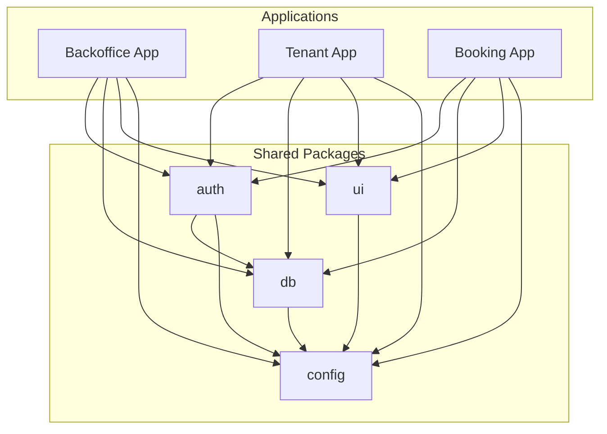

# Monorepo Structure

Sloty uses a monorepo architecture with Turbo for build optimization and shared packages for code reuse.

## Directory Structure

```
sloty-saas-appointment-system/
├── apps/                          # Applications
│   ├── backoffice/               # Superadmin interface (Port 3000)
│   │   ├── src/
│   │   │   ├── app/              # Next.js 15 App Router
│   │   │   │   ├── (auth)/       # Auth route group
│   │   │   │   ├── dashboard/    # Main dashboard
│   │   │   │   ├── tenants/      # Tenant management
│   │   │   │   ├── users/        # User management
│   │   │   │   └── settings/     # Global settings
│   │   │   ├── components/       # App-specific components
│   │   │   ├── lib/              # Utilities and configurations
│   │   │   └── types/            # TypeScript type definitions
│   │   ├── public/               # Static assets
│   │   ├── package.json          # Dependencies
│   │   ├── next.config.mjs       # Next.js configuration
│   │   ├── tailwind.config.ts    # Tailwind CSS configuration
│   │   └── tsconfig.json         # TypeScript configuration
│   │
│   ├── tenant/                   # Provider dashboard (Port 3001)
│   │   ├── src/
│   │   │   ├── app/              # Next.js 15 App Router
│   │   │   │   ├── (auth)/       # Auth route group
│   │   │   │   ├── dashboard/    # Main dashboard
│   │   │   │   ├── providers/    # Provider management
│   │   │   │   ├── services/     # Service catalog
│   │   │   │   ├── appointments/ # Appointment management
│   │   │   │   ├── calendar/     # Calendar views
│   │   │   │   ├── customers/    # Customer management
│   │   │   │   └── settings/     # Tenant settings
│   │   │   ├── components/       # App-specific components
│   │   │   ├── lib/              # Utilities and configurations
│   │   │   └── types/            # TypeScript type definitions
│   │   ├── public/               # Static assets
│   │   ├── package.json          # Dependencies
│   │   ├── next.config.mjs       # Next.js configuration
│   │   ├── tailwind.config.ts    # Tailwind CSS configuration
│   │   └── tsconfig.json         # TypeScript configuration
│   │
│   ├── booking/                  # Customer booking (Port 3002)
│   │   ├── src/
│   │   │   ├── app/              # Next.js 15 App Router
│   │   │   │   ├── [tenant]/     # Tenant-specific routing
│   │   │   │   │   ├── services/ # Service selection
│   │   │   │   │   ├── booking/  # Booking flow
│   │   │   │   │   └── confirm/  # Confirmation
│   │   │   │   └── api/          # API routes
│   │   │   ├── components/       # App-specific components
│   │   │   ├── lib/              # Utilities and configurations
│   │   │   └── types/            # TypeScript type definitions
│   │   ├── public/               # Static assets
│   │   ├── package.json          # Dependencies
│   │   ├── next.config.mjs       # Next.js configuration
│   │   ├── tailwind.config.ts    # Tailwind CSS configuration
│   │   └── tsconfig.json         # TypeScript configuration
│   │
│   └── docs/                     # Documentation site
│       ├── docs/                 # Documentation content
│       ├── src/                  # Docusaurus customizations
│       ├── docusaurus.config.ts  # Docusaurus configuration
│       ├── sidebars.ts           # Navigation structure
│       └── package.json          # Dependencies
│
├── packages/                     # Shared packages
│   ├── auth/                     # Authentication utilities
│   │   ├── src/
│   │   │   ├── config.ts         # NextAuth configuration
│   │   │   ├── providers/        # Auth providers
│   │   │   ├── middleware.ts     # Auth middleware
│   │   │   └── index.ts          # Public exports
│   │   ├── package.json
│   │   └── tsconfig.json
│   │
│   ├── db/                       # Database layer
│   │   ├── src/
│   │   │   ├── client.ts         # Prisma client setup
│   │   │   ├── types.ts          # Database types
│   │   │   ├── queries/          # Common queries
│   │   │   ├── mutations/        # Common mutations
│   │   │   └── index.ts          # Public exports
│   │   ├── package.json
│   │   └── tsconfig.json
│   │
│   ├── ui/                       # Shared UI components
│   │   ├── src/
│   │   │   ├── components/       # Reusable components
│   │   │   │   ├── ui/           # Basic UI components
│   │   │   │   ├── forms/        # Form components
│   │   │   │   ├── layout/       # Layout components
│   │   │   │   └── charts/       # Chart components
│   │   │   ├── hooks/            # Custom React hooks
│   │   │   ├── utils/            # Utility functions
│   │   │   └── index.ts          # Public exports
│   │   ├── package.json
│   │   └── tsconfig.json
│   │
│   └── config/                   # Configuration utilities
│       ├── src/
│       │   ├── env.ts            # Environment validation
│       │   ├── constants.ts      # Global constants
│       │   ├── types.ts          # Shared types
│       │   └── index.ts          # Public exports
│       ├── package.json
│       └── tsconfig.json
│
├── prisma/                       # Database schema
│   ├── schema.prisma             # Prisma schema definition
│   ├── migrations/               # Database migrations
│   ├── seed.ts                   # Database seed script
│   └── seed-data/                # Seed data files
│
├── scripts/                      # Build and utility scripts
│   ├── build.sh                  # Build script
│   ├── dev.sh                    # Development script
│   ├── test.sh                   # Test script
│   └── deploy.sh                 # Deployment script
│
├── .github/                      # GitHub configuration
│   └── workflows/                # CI/CD workflows
│       ├── ci.yml                # Continuous integration
│       ├── deploy-staging.yml    # Staging deployment
│       └── deploy-production.yml # Production deployment
│
├── turbo.json                    # Turbo build configuration
├── package.json                  # Root package.json
├── pnpm-workspace.yaml           # pnpm workspace configuration
├── .gitignore                    # Git ignore rules
├── .env.example                  # Environment variable template
└── README.md                     # Project documentation
```

## Package Management

### pnpm Workspaces

The project uses pnpm workspaces for efficient package management:

```yaml
# pnpm-workspace.yaml
packages:
  - "apps/*"
  - "packages/*"
```

### Benefits:

- **Efficient Installs**: Shared dependencies across packages
- **Hoisting**: Common dependencies moved to root
- **Symlinks**: Local packages linked via symlinks
- **Version Management**: Consistent versions across packages

## Turbo Build System

### Configuration

```json
{
  "pipeline": {
    "build": {
      "dependsOn": ["^build"],
      "outputs": [".next/**", "dist/**"]
    },
    "dev": {
      "cache": false,
      "persistent": true
    },
    "test": {
      "dependsOn": ["^build"]
    },
    "lint": {
      "dependsOn": ["^build"]
    },
    "type-check": {
      "dependsOn": ["^build"]
    }
  }
}
```

### Benefits:

- **Incremental Builds**: Only rebuild changed packages
- **Parallel Execution**: Run tasks across packages simultaneously
- **Caching**: Cache build outputs for faster subsequent builds
- **Dependency Tracking**: Understand package dependencies

## Shared Packages

### @repo/auth

**Purpose**: Centralized authentication logic

**Key Features**:
- NextAuth.js configuration
- JWT handling and validation
- Session management utilities
- Role-based access control helpers

**Usage**:
```typescript
import { authConfig } from '@repo/auth'
import { requireAuth } from '@repo/auth/middleware'
```

### @repo/db

**Purpose**: Database access layer

**Key Features**:
- Prisma client configuration
- Common database queries
- Type-safe database operations
- Connection management

**Usage**:
```typescript
import { db } from '@repo/db'
import { getTenantById } from '@repo/db/queries'
```

### @repo/ui

**Purpose**: Shared UI components

**Key Features**:
- Consistent design system
- Reusable React components
- Common hooks and utilities
- Tailwind CSS integration

**Usage**:
```typescript
import { Button, Card, Modal } from '@repo/ui'
import { useLocalStorage } from '@repo/ui/hooks'
```

### @repo/config

**Purpose**: Configuration and utilities

**Key Features**:
- Environment variable validation
- Global constants and types
- Utility functions
- Configuration schemas

**Usage**:
```typescript
import { env } from '@repo/config'
import { APPOINTMENT_STATUS } from '@repo/config/constants'
```

## Development Workflow

### Starting Development

```bash
# Install dependencies
pnpm install

# Start all applications
pnpm dev

# Or start specific applications
pnpm --filter backoffice dev
pnpm --filter tenant dev
pnpm --filter booking dev
```

### Building the Project

```bash
# Build all packages
pnpm build

# Build specific package
pnpm --filter @repo/ui build
```

### Running Tests

```bash
# Run all tests
pnpm test

# Run tests for specific package
pnpm --filter tenant test
```

## Package Dependencies

### Internal Dependencies



### External Dependencies

**Common across all apps**:
- Next.js 15
- React 19
- TypeScript 5
- Tailwind CSS 3
- Prisma ORM

**App-specific dependencies**:
- NextAuth.js (authentication)
- React Hook Form (form handling)
- Zod (validation)
- Recharts (charts and analytics)
- date-fns (date utilities)

## Code Organization Patterns

### File Naming Conventions

- **Components**: PascalCase (e.g., `AppointmentCard.tsx`)
- **Pages**: kebab-case (e.g., `appointment-details.tsx`)
- **Utilities**: camelCase (e.g., `formatDate.ts`)
- **Constants**: UPPER_SNAKE_CASE (e.g., `API_ENDPOINTS.ts`)

### Import Organization

```typescript
// 1. React imports
import React from 'react'
import { useState, useEffect } from 'react'

// 2. Third-party imports
import { NextPage } from 'next'
import { useRouter } from 'next/navigation'

// 3. Internal shared packages
import { Button } from '@repo/ui'
import { db } from '@repo/db'

// 4. Relative imports
import { AppointmentForm } from '../components/AppointmentForm'
import { useAppointments } from '../hooks/useAppointments'
```

### Component Structure

```typescript
// types.ts - Type definitions
export interface AppointmentCardProps {
  appointment: Appointment
  onEdit: (id: string) => void
}

// AppointmentCard.tsx - Component implementation
import type { AppointmentCardProps } from './types'

export function AppointmentCard({ appointment, onEdit }: AppointmentCardProps) {
  // Component logic
}

// index.ts - Public exports
export { AppointmentCard } from './AppointmentCard'
export type { AppointmentCardProps } from './types'
```

## Build Optimization

### Bundle Analysis

Each app includes bundle analysis:

```json
{
  "scripts": {
    "analyze": "ANALYZE=true next build",
    "build": "next build"
  }
}
```

### Code Splitting

- **Route-based splitting**: Automatic with Next.js App Router
- **Component-based splitting**: Dynamic imports for heavy components
- **Package splitting**: Separate bundles for different features

### Tree Shaking

- **ES Modules**: All packages use ES modules
- **Named Exports**: Avoid default exports where possible
- **Side-effect Free**: Mark packages as side-effect free

## Testing Strategy

### Unit Tests
- **Location**: `__tests__` directories next to source files
- **Framework**: Vitest for fast unit testing
- **Coverage**: Aim for >80% coverage on shared packages

### Integration Tests
- **Location**: `tests/` directory in each app
- **Framework**: Testing Library for React components
- **Database**: Test database for integration tests

### End-to-End Tests
- **Location**: `e2e/` directory in project root
- **Framework**: Playwright for cross-browser testing
- **Environment**: Staging environment for E2E tests

## Deployment Structure

### Environment-Specific Builds

```bash
# Development
pnpm dev

# Staging
pnpm build:staging
pnpm start:staging

# Production
pnpm build:production
pnpm start:production
```

### Docker Support

Each app includes a Dockerfile for containerization:

```dockerfile
FROM node:18-alpine AS base
WORKDIR /app
COPY package*.json ./
RUN npm install
COPY . .
RUN npm run build
CMD ["npm", "start"]
```

## Maintenance and Updates

### Dependency Updates

```bash
# Update all dependencies
pnpm update

# Update specific dependency
pnpm update next --recursive

# Check outdated packages
pnpm outdated
```

### Migration Strategy

1. **Gradual Migration**: Update packages incrementally
2. **Feature Flags**: Use feature flags for major changes
3. **Backward Compatibility**: Maintain API compatibility
4. **Testing**: Comprehensive testing before updates

---

Next, explore the [Data Model](/docs/architecture/data-model) to understand the database structure.
