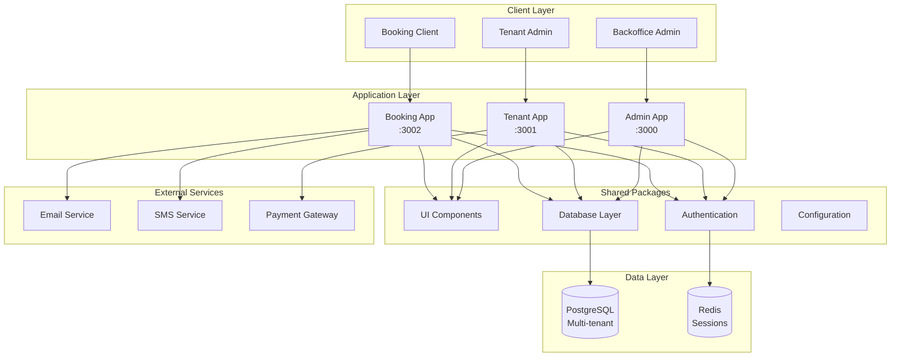
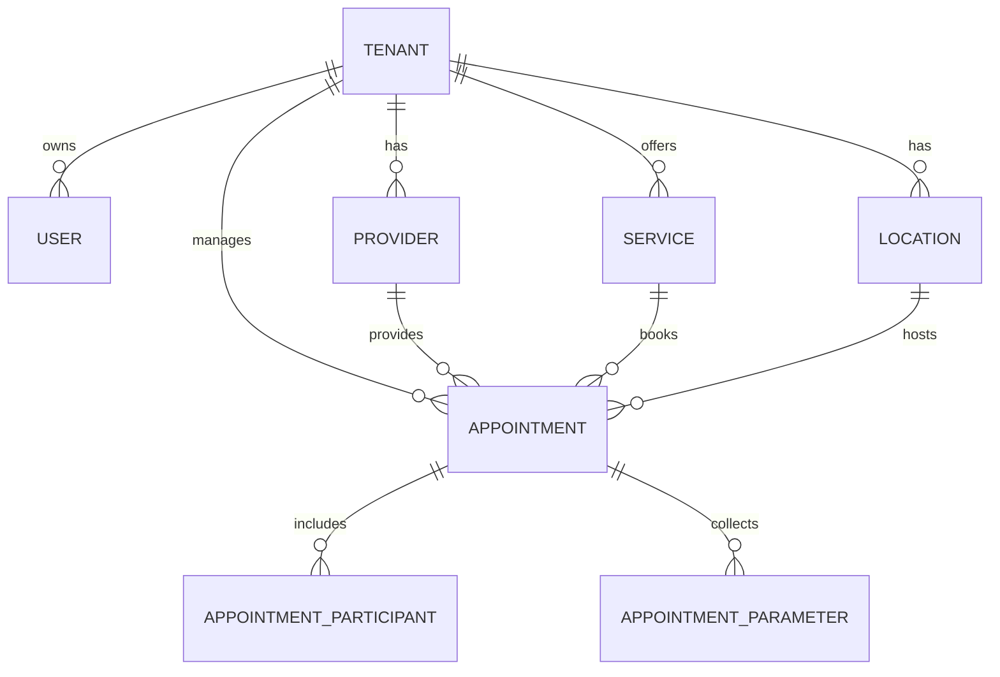
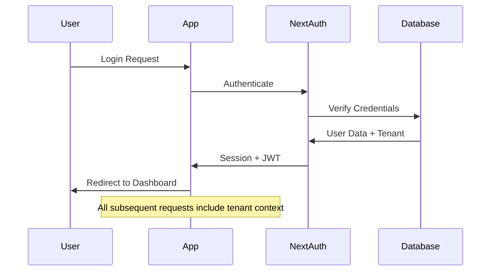
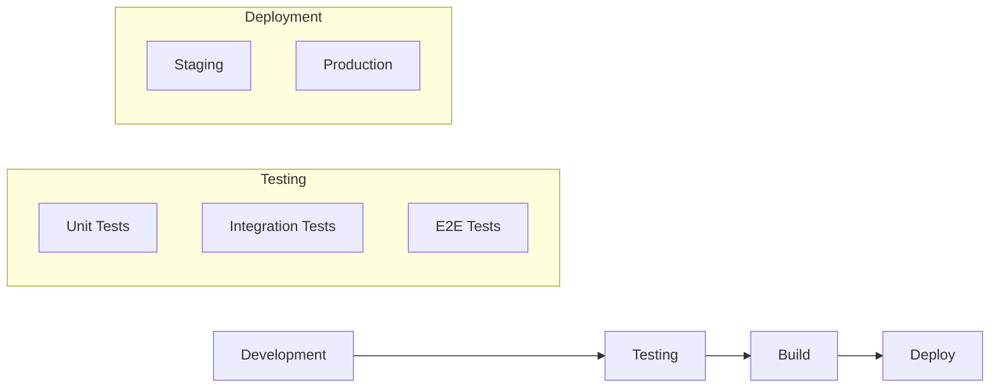

# Architecture Overview

Sloty is designed as a modern, scalable multi-tenant SaaS application with a microservice-oriented monorepo architecture.

## High-Level Architecture



## Core Principles

### 1. Multi-Tenancy First

Every data model and API is designed with tenant isolation in mind:

- **Row-Level Security**: Each table includes `tenantId` for data isolation
- **API Security**: All endpoints validate tenant access permissions
- **UI Isolation**: Users can only access their tenant's data

### 2. Monorepo with Shared Packages

The codebase is organized as a monorepo with shared packages:

```
sloty-saas-appointment-system/
├── apps/                   # Applications
│   ├── backoffice/        # Superadmin interface
│   ├── tenant/            # Provider admin dashboard  
│   ├── booking/           # Customer booking interface
│   └── docs/              # Documentation site
├── packages/              # Shared packages
│   ├── auth/              # Authentication utilities
│   ├── db/                # Database schema & client
│   ├── ui/                # Shared UI components
│   └── config/            # Configuration & utilities
└── prisma/               # Database migrations & schema
```

### 3. Type-Safe Development

- **TypeScript First**: All code written in TypeScript
- **Prisma ORM**: Type-safe database queries
- **Shared Types**: Common types shared across applications
- **API Contracts**: Strongly typed API endpoints

### 4. Modern Web Stack

- **Next.js 15**: Latest App Router with Server Components
- **React 19**: Latest React features and optimizations
- **Prisma ORM**: Type-safe database operations
- **Tailwind CSS**: Utility-first styling
- **PostgreSQL**: Robust, scalable database

## Application Architecture

### Backoffice Application (Port 3000)

**Purpose**: Superadmin interface for managing tenants and global settings

**Key Features**:
- Tenant management and billing
- Global system configuration
- User management across tenants
- System health monitoring
- Billing and subscription management

**Target Users**: System administrators

### Tenant Application (Port 3001)

**Purpose**: Provider admin dashboard for managing appointments and services

**Key Features**:
- Provider and staff management
- Service catalog configuration
- Appointment scheduling and management
- Calendar views and availability
- Reporting and analytics
- Patient/customer management

**Target Users**: Practice administrators, providers, staff

### Booking Application (Port 3002)

**Purpose**: Customer-facing booking interface

**Key Features**:
- Service browsing and selection
- Real-time availability checking
- Dynamic parameter collection
- Appointment booking flow
- Confirmation and reminders
- Customer profile management

**Target Users**: End customers, patients

## Data Architecture

### Multi-Tenant Data Model



### Key Data Principles

1. **Tenant Isolation**: Every table includes `tenantId`
2. **Referential Integrity**: Proper foreign key constraints
3. **Audit Trail**: `createdAt` and `updatedAt` on all records
4. **Soft Deletes**: Important records marked inactive vs deleted
5. **Optimized Indexes**: Strategic indexing for performance

## Security Architecture

### Authentication Flow



### Authorization Layers

1. **Route Protection**: Pages require authentication
2. **API Guards**: Endpoints validate permissions
3. **Tenant Isolation**: Data queries filtered by tenant
4. **Role-Based Access**: Actions restricted by user role

### Security Features

- **JWT Tokens**: Stateless authentication
- **Session Management**: Secure session storage
- **CSRF Protection**: Cross-site request forgery prevention
- **Input Validation**: Comprehensive input sanitization
- **SQL Injection Prevention**: Parameterized queries via Prisma

## Performance Architecture

### Frontend Optimization

- **Server Components**: Reduced client-side JavaScript
- **Static Generation**: Pre-rendered pages where possible
- **Image Optimization**: Automatic image optimization
- **Code Splitting**: Lazy-loaded components
- **Bundle Analysis**: Optimized bundle sizes

### Database Optimization

- **Connection Pooling**: Efficient database connections
- **Query Optimization**: Indexed queries and efficient joins
- **Caching Strategy**: Redis for sessions and frequently accessed data
- **Read Replicas**: Planned for scaling read operations

### API Performance

- **Response Caching**: Cached API responses where appropriate
- **Pagination**: Efficient data pagination
- **Selective Loading**: Only load required data
- **Background Jobs**: Async processing for heavy operations

## Scalability Considerations

### Horizontal Scaling

- **Stateless Applications**: Easy to scale across multiple instances
- **Database Scaling**: Read replicas for read-heavy workloads
- **CDN Integration**: Static assets served via CDN
- **Load Balancing**: Multiple application instances

### Vertical Scaling

- **Resource Optimization**: Efficient memory and CPU usage
- **Database Tuning**: Optimized PostgreSQL configuration
- **Caching Layers**: Multiple levels of caching

## Deployment Architecture

### Development Environment

```bash
# Local development
pnpm dev  # Starts all apps on different ports
```

### Production Deployment

Options include:

1. **Docker Containers**: Containerized applications
2. **Serverless**: Vercel/Netlify deployment
3. **Traditional VPS**: PM2 process management
4. **Kubernetes**: Container orchestration

### CI/CD Pipeline



## Technology Decisions

### Why Next.js?

- **Full-Stack Framework**: Frontend and API in one codebase
- **Server Components**: Improved performance and SEO
- **App Router**: Modern routing with layouts
- **TypeScript Support**: First-class TypeScript integration
- **Deployment Options**: Multiple deployment strategies

### Why PostgreSQL?

- **ACID Compliance**: Reliable transactions
- **JSON Support**: Flexible schema for parameters
- **Performance**: Excellent query performance
- **Extensions**: Rich ecosystem of extensions
- **Scaling**: Proven at scale

### Why Prisma?

- **Type Safety**: Generated TypeScript types
- **Migration System**: Robust schema migrations
- **Developer Experience**: Excellent tooling and debugging
- **Performance**: Efficient query generation
- **Multi-Database**: Support for multiple databases

## Next Steps

Explore specific aspects of the architecture:

1. [Monorepo Structure](/docs/architecture/monorepo-structure) - Detailed code organization
2. [Data Model](/docs/architecture/data-model) - Complete database schema
3. [Multi-Tenancy](/docs/architecture/multi-tenancy) - Tenant isolation strategies

---

Understanding the architecture? Continue to explore the [Data Model](/docs/architecture/data-model).
