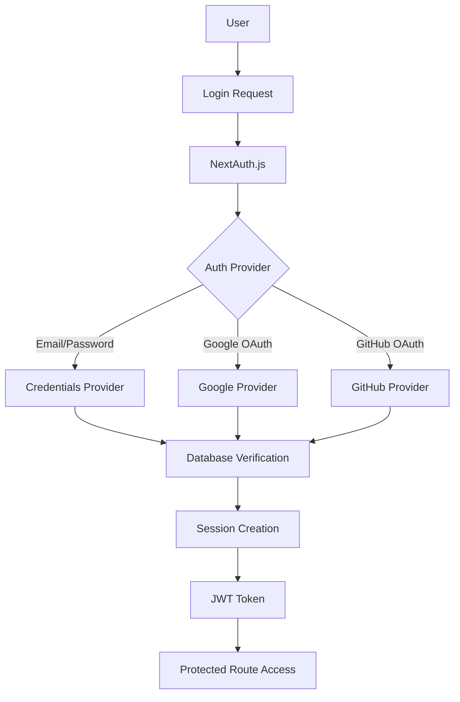

# Authentication Overview

Sloty uses NextAuth.js for secure, flexible authentication with support for multiple providers and robust session management.

## Authentication Architecture



## Supported Authentication Methods

### 1. Email/Password Authentication

Traditional username/password authentication with secure password hashing:

```typescript
// Credentials provider configuration
{
  id: "credentials",
  name: "Email and Password",
  credentials: {
    email: { label: "Email", type: "email" },
    password: { label: "Password", type: "password" }
  },
  async authorize(credentials) {
    if (!credentials?.email || !credentials?.password) return null
    
    const user = await db.user.findUnique({
      where: { email: credentials.email },
      include: { tenant: true }
    })
    
    if (!user || !user.password) return null
    
    const isValid = await bcrypt.compare(credentials.password, user.password)
    if (!isValid) return null
    
    return {
      id: user.id,
      email: user.email,
      name: user.name,
      tenantId: user.tenantId,
      role: user.role,
    }
  }
}
```

### 2. OAuth Providers

Social login with popular OAuth providers:

**Supported Providers**:
- Google OAuth 2.0
- GitHub OAuth
- Microsoft Azure AD
- Facebook (optional)
- Apple (optional)

```typescript
// Google OAuth configuration
{
  id: "google",
  name: "Google",
  type: "oauth",
  clientId: process.env.GOOGLE_CLIENT_ID,
  clientSecret: process.env.GOOGLE_CLIENT_SECRET,
  authorization: {
    params: {
      scope: "openid email profile",
      prompt: "select_account",
    }
  }
}
```

### 3. Magic Link Authentication

Passwordless authentication via email:

```typescript
// Email provider for magic links
{
  id: "email",
  type: "email",
  server: {
    host: process.env.SMTP_HOST,
    port: process.env.SMTP_PORT,
    auth: {
      user: process.env.SMTP_USER,
      pass: process.env.SMTP_PASSWORD,
    }
  },
  from: process.env.EMAIL_FROM,
}
```

## User Roles & Permissions

### Role Hierarchy

```typescript
enum UserRole {
  SUPER_ADMIN    = "SUPER_ADMIN",    // Platform administrator
  TENANT_ADMIN   = "TENANT_ADMIN",   // Tenant administrator
  PROVIDER       = "PROVIDER",       // Service provider
  STAFF          = "STAFF",          // Support staff
  USER           = "USER",           // Regular user
}
```

### Permission Matrix

| Action | Super Admin | Tenant Admin | Provider | Staff | User |
|--------|-------------|--------------|----------|-------|------|
| Manage Tenants | ✅ | ❌ | ❌ | ❌ | ❌ |
| Tenant Settings | ✅ | ✅ | ❌ | ❌ | ❌ |
| Manage Providers | ✅ | ✅ | ❌ | ❌ | ❌ |
| Manage Services | ✅ | ✅ | ✅ | ❌ | ❌ |
| View Appointments | ✅ | ✅ | ✅* | ✅* | ❌ |
| Manage Own Schedule | ✅ | ✅ | ✅ | ❌ | ❌ |
| Book Appointments | ✅ | ✅ | ✅ | ✅ | ✅ |

*Only own appointments or assigned appointments

### Role-Based Access Control

```typescript
// middleware/auth.ts
export function requireRole(allowedRoles: UserRole[]) {
  return async (request: NextRequest) => {
    const session = await getServerSession(authOptions)
    
    if (!session?.user) {
      return NextResponse.redirect('/auth/signin')
    }
    
    if (!allowedRoles.includes(session.user.role)) {
      return NextResponse.json(
        { error: 'Insufficient permissions' }, 
        { status: 403 }
      )
    }
    
    return NextResponse.next()
  }
}

// Usage in API routes
export const middleware = requireRole([UserRole.TENANT_ADMIN, UserRole.SUPER_ADMIN])
```

## Session Management

### JWT Configuration

```typescript
// JWT settings in NextAuth config
jwt: {
  strategy: "jwt",
  maxAge: 30 * 24 * 60 * 60, // 30 days
  secret: process.env.NEXTAUTH_SECRET,
},

// JWT callback to include custom claims
callbacks: {
  async jwt({ token, user, account }) {
    if (user) {
      token.role = user.role
      token.tenantId = user.tenantId
      token.tenantSlug = user.tenant?.slug
    }
    return token
  },
  
  async session({ session, token }) {
    session.user.id = token.sub!
    session.user.role = token.role as UserRole
    session.user.tenantId = token.tenantId as string
    session.user.tenantSlug = token.tenantSlug as string
    return session
  }
}
```

### Session Security

**Security Features**:
- **CSRF Protection**: Built-in CSRF token validation
- **Secure Cookies**: HttpOnly, Secure, SameSite cookies
- **Session Rotation**: Automatic session refresh
- **Concurrent Session Limits**: Optional session limiting

```typescript
// Session configuration
session: {
  strategy: "jwt",
  maxAge: 30 * 24 * 60 * 60, // 30 days
  updateAge: 24 * 60 * 60,    // 24 hours
},

cookies: {
  sessionToken: {
    name: `__Secure-next-auth.session-token`,
    options: {
      httpOnly: true,
      sameSite: 'lax',
      path: '/',
      secure: process.env.NODE_ENV === 'production'
    }
  }
}
```

## Multi-Tenant Authentication

### Tenant Context Resolution

Authentication integrates with tenant resolution:

```typescript
// Enhanced session with tenant context
interface Session {
  user: {
    id: string
    email: string
    name: string
    role: UserRole
    tenantId: string
    tenantSlug: string
    tenant: {
      name: string
      settings: TenantSettings
    }
  }
}

// Middleware for tenant-aware authentication
export async function authMiddleware(request: NextRequest) {
  const session = await getServerSession()
  const tenantSlug = getTenantSlug(request)
  
  // Verify user belongs to requested tenant
  if (session?.user.tenantSlug !== tenantSlug) {
    return NextResponse.redirect('/unauthorized')
  }
  
  return NextResponse.next()
}
```

### Cross-Tenant Access Prevention

```typescript
// API route protection
export async function GET(
  request: NextRequest,
  { params }: { params: { tenantId: string } }
) {
  const session = await requireAuth()
  
  // Prevent cross-tenant access
  if (session.user.role !== 'SUPER_ADMIN' && 
      session.user.tenantId !== params.tenantId) {
    return NextResponse.json(
      { error: 'Access denied' },
      { status: 403 }
    )
  }
  
  // Safe to proceed
}
```

## Authentication Hooks

### useAuth Hook

```typescript
// hooks/useAuth.ts
import { useSession } from 'next-auth/react'

export function useAuth() {
  const { data: session, status } = useSession()
  
  return {
    user: session?.user,
    isAuthenticated: status === 'authenticated',
    isLoading: status === 'loading',
    
    // Role checks
    isSuperAdmin: session?.user.role === 'SUPER_ADMIN',
    isTenantAdmin: session?.user.role === 'TENANT_ADMIN',
    isProvider: session?.user.role === 'PROVIDER',
    
    // Permission checks
    canManageTenant: ['SUPER_ADMIN', 'TENANT_ADMIN'].includes(session?.user.role),
    canManageProviders: ['SUPER_ADMIN', 'TENANT_ADMIN'].includes(session?.user.role),
    canManageAppointments: ['SUPER_ADMIN', 'TENANT_ADMIN', 'PROVIDER'].includes(session?.user.role),
  }
}
```

### Protected Route Component

```typescript
// components/ProtectedRoute.tsx
interface ProtectedRouteProps {
  children: React.ReactNode
  requiredRole?: UserRole[]
  fallback?: React.ReactNode
}

export function ProtectedRoute({ 
  children, 
  requiredRole = [], 
  fallback = <UnauthorizedPage /> 
}: ProtectedRouteProps) {
  const { user, isLoading } = useAuth()
  
  if (isLoading) {
    return <LoadingSpinner />
  }
  
  if (!user) {
    return <SignInPrompt />
  }
  
  if (requiredRole.length > 0 && !requiredRole.includes(user.role)) {
    return fallback
  }
  
  return <>{children}</>
}

// Usage
<ProtectedRoute requiredRole={[UserRole.TENANT_ADMIN]}>
  <TenantSettingsPage />
</ProtectedRoute>
```

## Password Security

### Password Requirements

```typescript
// lib/validation/password.ts
import { z } from 'zod'

export const passwordSchema = z
  .string()
  .min(8, 'Password must be at least 8 characters')
  .regex(/[a-z]/, 'Password must contain at least one lowercase letter')
  .regex(/[A-Z]/, 'Password must contain at least one uppercase letter')
  .regex(/[0-9]/, 'Password must contain at least one number')
  .regex(/[^a-zA-Z0-9]/, 'Password must contain at least one special character')

// Common passwords check
const commonPasswords = [
  'password', '123456', 'password123', 'admin', 'qwerty'
]

export function isCommonPassword(password: string): boolean {
  return commonPasswords.includes(password.toLowerCase())
}
```

### Password Hashing

```typescript
// lib/password.ts
import bcrypt from 'bcryptjs'

export async function hashPassword(password: string): Promise<string> {
  const saltRounds = 12
  return await bcrypt.hash(password, saltRounds)
}

export async function verifyPassword(
  password: string, 
  hashedPassword: string
): Promise<boolean> {
  return await bcrypt.compare(password, hashedPassword)
}
```

## Account Management

### User Registration

```typescript
// app/api/auth/register/route.ts
export async function POST(request: Request) {
  const { email, password, name, tenantSlug } = await request.json()
  
  // Validate input
  const validation = registerSchema.safeParse({
    email, password, name, tenantSlug
  })
  
  if (!validation.success) {
    return NextResponse.json({ 
      error: validation.error.issues 
    }, { status: 400 })
  }
  
  // Check if user exists
  const existingUser = await db.user.findUnique({
    where: { email }
  })
  
  if (existingUser) {
    return NextResponse.json({
      error: 'User already exists'
    }, { status: 409 })
  }
  
  // Find tenant
  const tenant = await db.tenant.findUnique({
    where: { slug: tenantSlug }
  })
  
  if (!tenant) {
    return NextResponse.json({
      error: 'Tenant not found'
    }, { status: 404 })
  }
  
  // Create user
  const hashedPassword = await hashPassword(password)
  
  const user = await db.user.create({
    data: {
      email,
      name,
      password: hashedPassword,
      tenantId: tenant.id,
      role: 'USER',
      status: 'PENDING_VERIFICATION'
    }
  })
  
  // Send verification email
  await sendVerificationEmail(user.email, user.id)
  
  return NextResponse.json({
    message: 'User created successfully'
  })
}
```

### Email Verification

```typescript
// Email verification flow
export async function sendVerificationEmail(email: string, userId: string) {
  const token = await createVerificationToken(userId)
  const verificationUrl = `${process.env.NEXTAUTH_URL}/auth/verify?token=${token}`
  
  await sendEmail({
    to: email,
    subject: 'Verify your email address',
    template: 'email-verification',
    data: {
      verificationUrl,
      expiresIn: '24 hours'
    }
  })
}

// Verification endpoint
export async function verifyEmail(token: string) {
  const verification = await db.verificationToken.findUnique({
    where: { token }
  })
  
  if (!verification || verification.expires < new Date()) {
    throw new Error('Invalid or expired token')
  }
  
  await db.user.update({
    where: { id: verification.identifier },
    data: { 
      status: 'ACTIVE',
      emailVerified: new Date()
    }
  })
  
  await db.verificationToken.delete({
    where: { token }
  })
}
```

## Security Best Practices

### Rate Limiting

```typescript
// Rate limiting for authentication endpoints
const authLimiter = rateLimit({
  windowMs: 15 * 60 * 1000, // 15 minutes
  max: 5, // 5 attempts per window
  message: 'Too many authentication attempts',
  standardHeaders: true,
  legacyHeaders: false,
})

// Apply to auth routes
export const middleware = authLimiter
```

### Account Lockout

```typescript
// Track failed login attempts
export async function trackFailedLogin(email: string) {
  const user = await db.user.findUnique({ where: { email } })
  if (!user) return
  
  const failedAttempts = (user.failedLoginAttempts || 0) + 1
  const lockUntil = failedAttempts >= 5 
    ? new Date(Date.now() + 30 * 60 * 1000) // 30 min lockout
    : undefined
  
  await db.user.update({
    where: { id: user.id },
    data: {
      failedLoginAttempts: failedAttempts,
      lockedUntil: lockUntil
    }
  })
}

export async function isAccountLocked(email: string): Promise<boolean> {
  const user = await db.user.findUnique({ where: { email } })
  return user?.lockedUntil ? user.lockedUntil > new Date() : false
}
```

## Authentication Testing

### Unit Tests

```typescript
// __tests__/auth.test.ts
import { validateCredentials } from '@/lib/auth'

describe('Authentication', () => {
  it('should validate correct credentials', async () => {
    const result = await validateCredentials('user@test.com', 'password123')
    expect(result).toBeTruthy()
    expect(result.email).toBe('user@test.com')
  })
  
  it('should reject invalid credentials', async () => {
    const result = await validateCredentials('user@test.com', 'wrongpass')
    expect(result).toBeNull()
  })
  
  it('should enforce password requirements', () => {
    expect(isValidPassword('weak')).toBe(false)
    expect(isValidPassword('StrongP@ss123')).toBe(true)
  })
})
```

### Integration Tests

```typescript
// __tests__/auth-flow.test.ts
import { render, fireEvent, waitFor } from '@testing-library/react'
import SignInForm from '@/components/auth/SignInForm'

describe('Authentication Flow', () => {
  it('should complete sign in process', async () => {
    const { getByLabelText, getByRole } = render(<SignInForm />)
    
    fireEvent.change(getByLabelText(/email/i), {
      target: { value: 'test@example.com' }
    })
    
    fireEvent.change(getByLabelText(/password/i), {
      target: { value: 'password123' }
    })
    
    fireEvent.click(getByRole('button', { name: /sign in/i }))
    
    await waitFor(() => {
      expect(mockRouter.push).toHaveBeenCalledWith('/dashboard')
    })
  })
})
```

---

Continue with [Role-Based Access Control](/docs/authentication/role-based-access) for detailed permission management.
