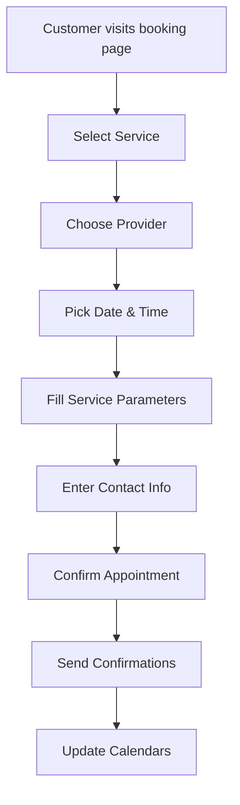
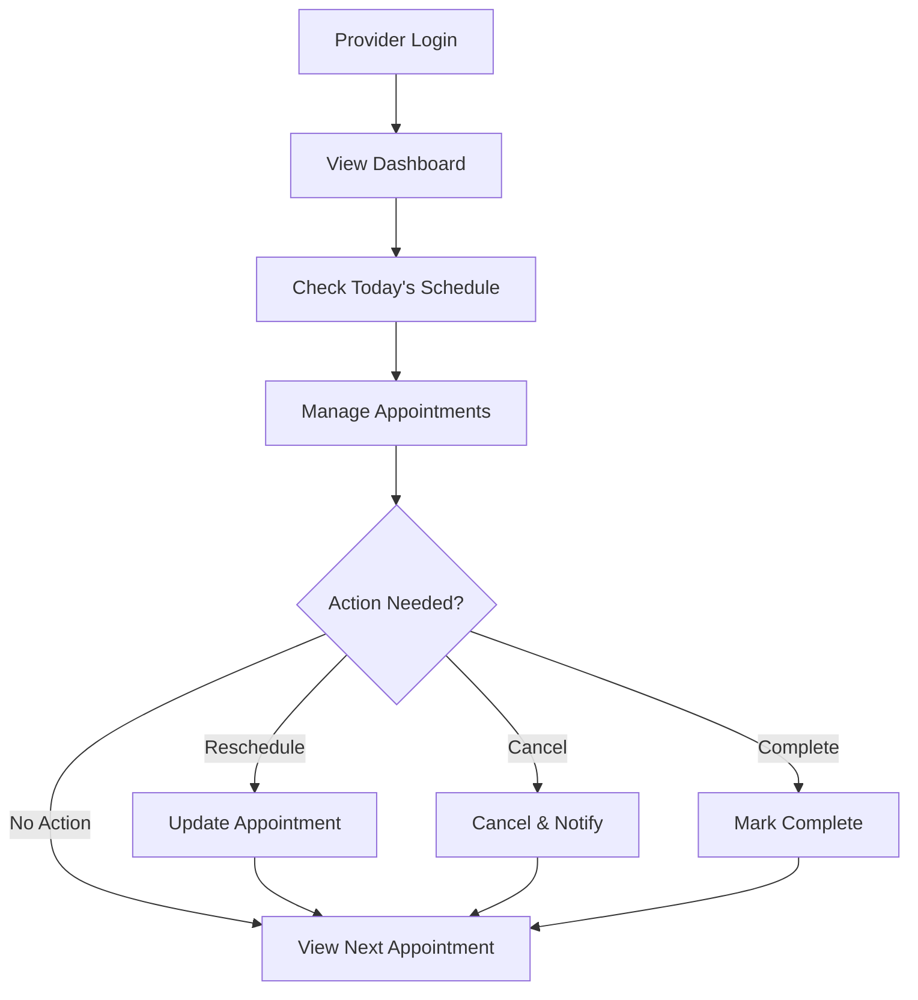
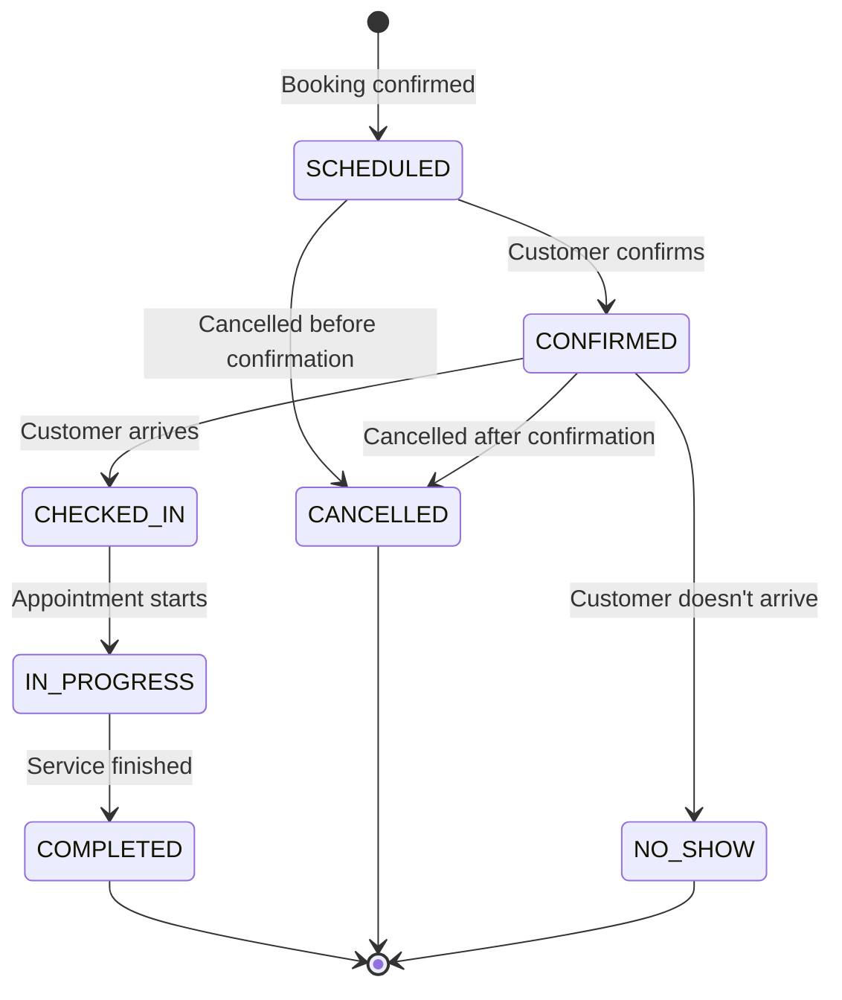
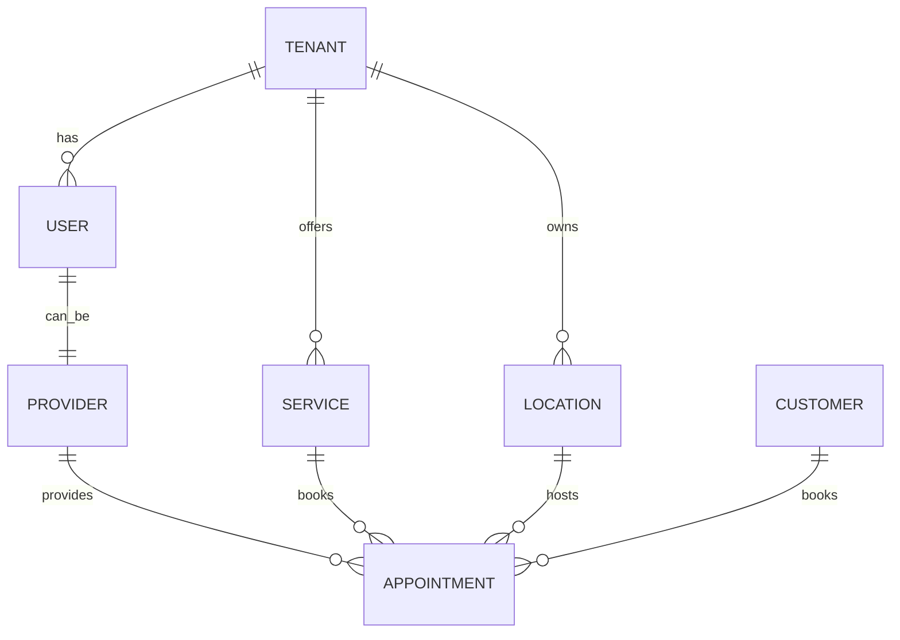

# Core Concepts Overview

Understanding the fundamental concepts that power Sloty's appointment booking system.

## Key Components

Sloty is built around several core concepts that work together to provide a complete appointment management solution:

### 🏢 Tenants
**Multi-tenant organizations** that use Sloty to manage their appointments.
- Healthcare practices, clinics, dental offices
- Salons, spas, fitness centers  
- Consulting firms, law offices
- Educational institutions

### 👥 Users & Roles
**People who interact** with the system in different capacities:
- **Super Admins**: Platform administrators
- **Tenant Admins**: Organization administrators  
- **Providers**: Service providers (doctors, therapists, etc.)
- **Staff**: Support staff and assistants
- **Customers**: People booking appointments

### 🏪 Locations
**Physical or virtual places** where services are provided:
- Office buildings, clinics, hospitals
- Remote/online consultation rooms
- Multiple locations per tenant supported

### 🩺 Providers  
**Service providers** who offer appointments:
- Doctors, nurses, therapists
- Consultants, lawyers, advisors
- Trainers, stylists, technicians
- Can work at multiple locations
- Have individual schedules and availability

### 🛎️ Services
**Bookable offerings** that customers can schedule:
- Medical consultations, procedures
- Fitness sessions, classes
- Beauty treatments, styling
- Legal consultations, meetings
- Each with duration, pricing, requirements

### 📅 Appointments
**Scheduled interactions** between providers and customers:
- Date, time, duration
- Service being provided
- Location where it occurs
- Status tracking and management

### 👤 Customers
**People who book appointments**:
- Contact information
- Booking history
- Preferences and notes
- Communication preferences

## System Workflows

### 🎯 Booking Flow



1. **Service Selection**: Customer browses available services
2. **Provider Choice**: Select preferred provider (if multiple available)
3. **Time Selection**: Pick from available time slots
4. **Parameter Collection**: Fill service-specific requirements
5. **Contact Information**: Provide booking details
6. **Confirmation**: Review and confirm appointment
7. **Notifications**: Automated confirmations sent
8. **Calendar Updates**: Provider schedules updated

### 🔧 Management Flow



## Service Configuration

### 📋 Service Parameters

Services can collect additional information through dynamic parameters:

**Parameter Types**:
- **Text**: Name, notes, descriptions
- **Number**: Age, weight, quantity
- **Date/Time**: Preferred times, birth date
- **Select**: Dropdown choices
- **Boolean**: Yes/no questions
- **File**: Upload documents, images

**Example Medical Consultation**:
```json
{
  "parameters": [
    {
      "name": "reason",
      "label": "Reason for visit",
      "type": "TEXTAREA",
      "required": true
    },
    {
      "name": "symptoms",
      "label": "Current symptoms",
      "type": "MULTISELECT", 
      "options": ["Pain", "Fatigue", "Nausea", "Other"]
    },
    {
      "name": "medications",
      "label": "Current medications",
      "type": "TEXT"
    },
    {
      "name": "insurance",
      "label": "Insurance provider",
      "type": "SELECT",
      "options": ["Blue Cross", "Aetna", "Cigna", "Self-pay"]
    }
  ]
}
```

### ⏱️ Scheduling Rules

Services have flexible scheduling configuration:

- **Duration**: How long the appointment takes
- **Buffer Time**: Padding between appointments  
- **Advance Booking**: How far in advance bookings allowed
- **Approval Required**: Manual approval vs auto-confirmation
- **Location Restrictions**: Which locations offer this service
- **Provider Restrictions**: Which providers can deliver this service

## Provider Availability

### 📅 Availability Patterns

Providers have sophisticated availability management:

**Regular Schedule**:
```json
{
  "monday": { "start": "09:00", "end": "17:00" },
  "tuesday": { "start": "09:00", "end": "17:00" },
  "wednesday": { "start": "10:00", "end": "14:00" },
  "thursday": { "start": "09:00", "end": "17:00" },
  "friday": { "start": "09:00", "end": "15:00" },
  "saturday": "closed",
  "sunday": "closed"
}
```

**Schedule Overrides**:
- Vacation time blocking
- Holiday closures  
- Sick leave
- Special availability
- Training sessions
- Meeting blocks

**Availability Validation**:
- Prevents double-booking
- Respects buffer times
- Considers travel time between locations
- Handles recurring appointments

## Appointment Lifecycle

### 📊 Status Management

Appointments progress through various states:



**Status Definitions**:
- **SCHEDULED**: Initially booked, awaiting confirmation
- **CONFIRMED**: Customer has confirmed attendance  
- **CHECKED_IN**: Customer has arrived and checked in
- **IN_PROGRESS**: Service is currently being provided
- **COMPLETED**: Service finished successfully
- **CANCELLED**: Appointment cancelled by customer or provider
- **NO_SHOW**: Customer didn't show up for appointment
- **RESCHEDULED**: Moved to different date/time

### 🔔 Notifications & Reminders

Automated communication keeps everyone informed:

**Booking Confirmations**:
- Immediate confirmation email
- Calendar invites (.ics files)
- SMS confirmation (optional)

**Appointment Reminders**:
- 24-hour advance reminder
- 2-hour advance reminder  
- Customizable timing per tenant
- Email and SMS options

**Status Updates**:
- Cancellation notifications
- Reschedule confirmations
- Provider changes
- Location updates

## Data Architecture Concepts

### 🏗️ Multi-Tenancy

Every piece of data belongs to a tenant:

- **Complete Isolation**: Tenants can't access each other's data
- **Scalable Design**: Single database serves multiple tenants
- **Customization**: Each tenant can customize their experience
- **Security**: Row-level security prevents data leaks

### 🔗 Relationships

Key relationships in the system:



### 📈 Scalability Patterns

Built for growth from day one:

- **Database Optimization**: Proper indexing for performance
- **Connection Pooling**: Efficient database connections
- **Caching Strategy**: Redis for sessions and frequent data
- **API Optimization**: Pagination and selective loading
- **Background Jobs**: Async processing for heavy operations

## Security & Privacy

### 🔒 Data Protection

Comprehensive security measures:

- **Authentication**: NextAuth.js with multiple providers
- **Authorization**: Role-based access control (RBAC)
- **Tenant Isolation**: Complete data separation
- **Input Validation**: Zod schemas for all inputs
- **SQL Injection Prevention**: Prisma ORM protection
- **CSRF Protection**: Built-into Next.js

### 🏥 HIPAA Considerations

Healthcare-specific compliance features:

- **Audit Trails**: All data changes logged
- **Data Encryption**: At rest and in transit
- **Access Controls**: Minimum necessary access
- **Business Associate Agreements**: Compliance documentation
- **Data Retention**: Configurable retention policies

## Integration Capabilities  

### 🔌 External Systems

Built for integration:

**Email Providers**:
- SendGrid, Mailgun, AWS SES
- SMTP for custom providers

**SMS Providers**: 
- Twilio, AWS SNS
- Configurable per tenant

**Payment Processing**:
- Stripe integration
- Recurring subscription billing
- Per-tenant payment configuration

**Calendar Systems**:
- Google Calendar sync
- Outlook integration
- CalDAV support

**Electronic Health Records**:
- HL7 FHIR standards
- RESTful API endpoints
- Webhook notifications

## Customization & Branding

### 🎨 White-Label Features

Each tenant can customize their experience:

**Visual Branding**:
- Logo and favicon
- Color scheme
- Custom CSS
- Font selection

**Domain Configuration**:
- Custom domain support
- Subdomain provision
- SSL certificate management

**Communication Templates**:
- Email templates
- SMS message templates
- Confirmation language
- Multi-language support

---

Ready to dive deeper? Start with [Authentication](/docs/core-concepts/authentication) to understand user management.
