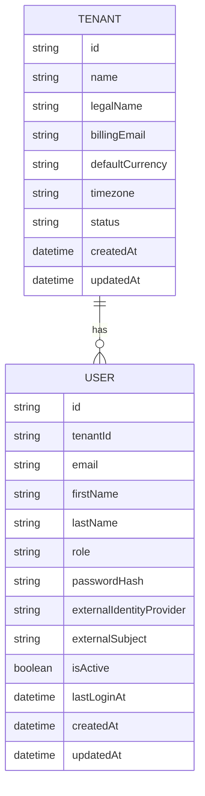
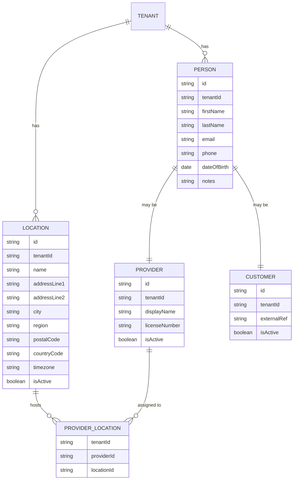
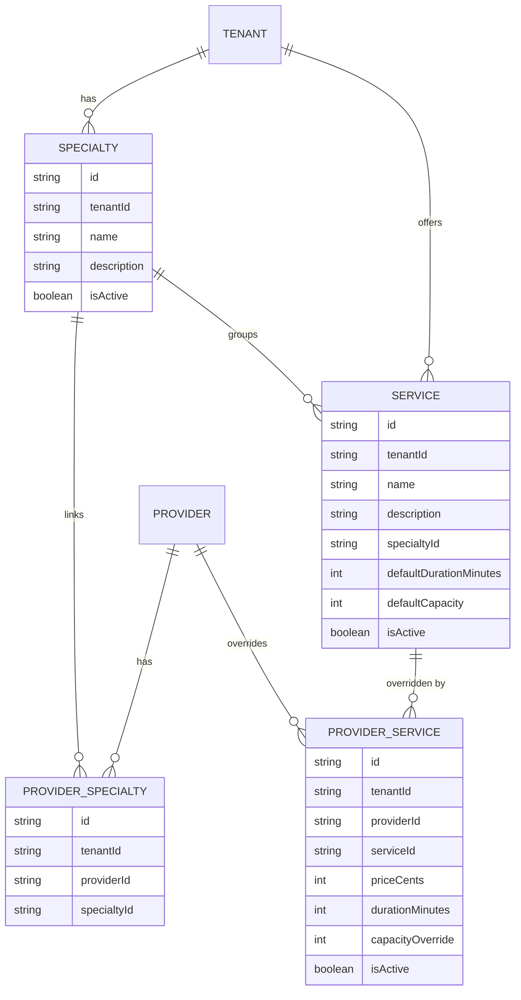
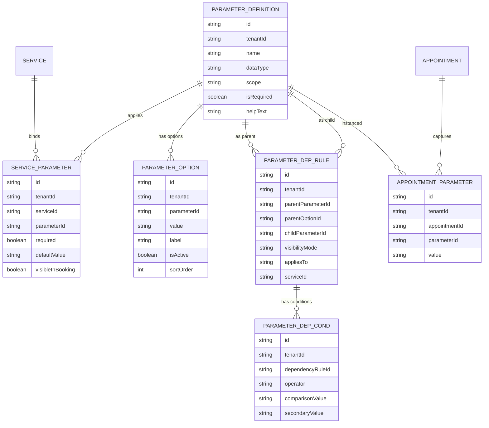
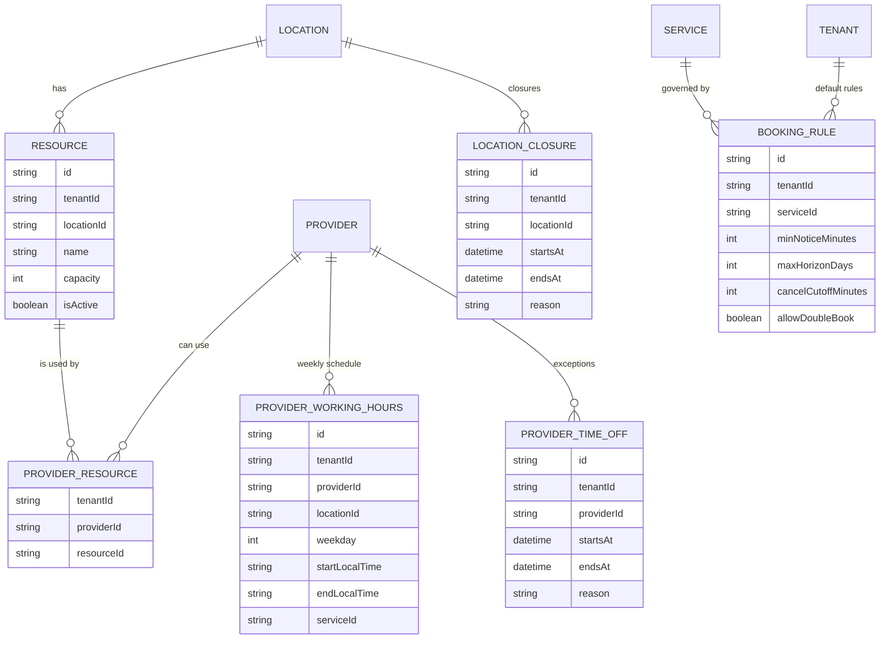
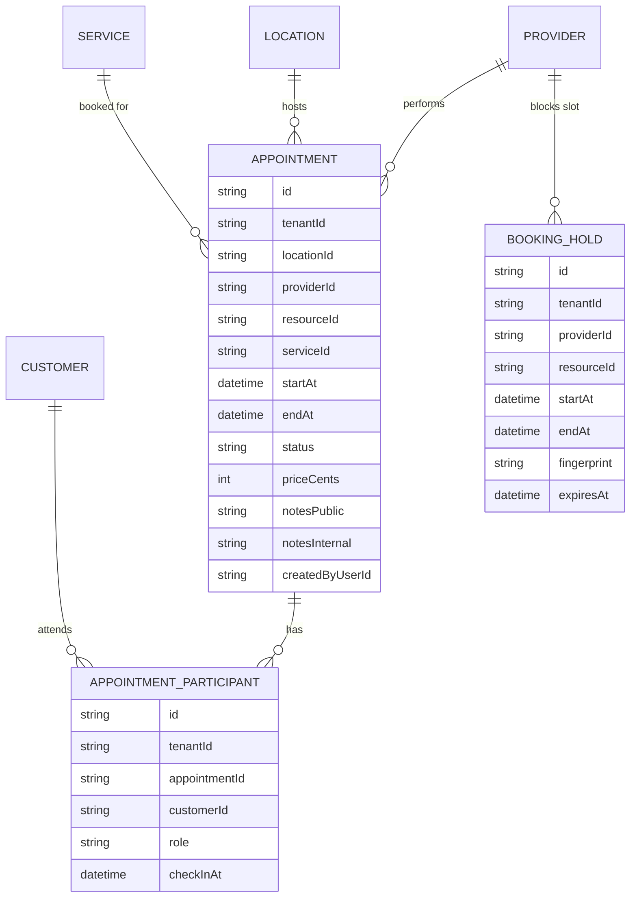
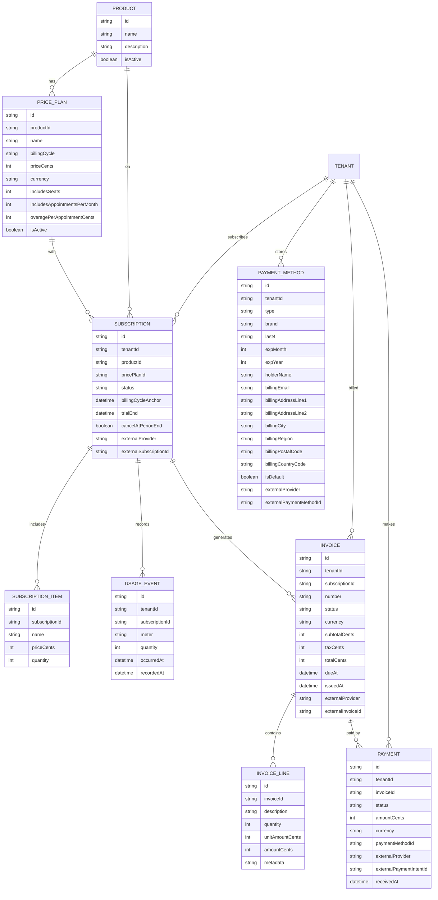

# Sloty Data Model (SaaS, Multi‑Tenant)

This document describes the **logical data structure** for **Sloty — SaaS Appointment System**.  
It’s technology-agnostic (no SQL), aligned with **multi-tenancy**, **nested booking parameters**, **availability**, and **billing**.

> All entities include `tenantId` unless otherwise noted. Timestamps are UTC (`createdAt`, `updatedAt`, etc.). IDs can be UUID/ULID/CUID.

---

## 1) Tenancy & Access

### Entities
- **Tenant**
  - id, name, legalName, billingEmail, defaultCurrency, timezone, status
  - createdAt, updatedAt
- **User**
  - id, tenantId, email, firstName, lastName, role (owner/admin/staff/viewer)
  - passwordHash _or_ externalIdentityProvider + externalSubject
  - isActive, lastLoginAt, createdAt, updatedAt

### Mermaid — Tenancy


---

## 2) Locations, People & Providers

### Entities
- **Location**
  - id, tenantId, name, addressLine1, addressLine2, city, region, postalCode, countryCode, timezone, isActive
- **Person**
  - id, tenantId, firstName, lastName, email?, phone?, dateOfBirth?, notes?
- **Provider** (1‑to‑1 with Person)
  - id (= Person.id), tenantId, displayName?, licenseNumber?, isActive
- **Customer** (1‑to‑1 with Person)
  - id (= Person.id), tenantId, externalRef?, isActive
- **ProviderLocation**
  - tenantId, providerId, locationId

### Mermaid — People


---

## 3) Catalog: Specialties & Services

### Entities
- **Specialty**
  - id, tenantId, name, description?, isActive
- **ProviderSpecialty**
  - id, tenantId, providerId, specialtyId
- **Service**
  - id, tenantId, name, description?, specialtyId?, defaultDurationMinutes, defaultCapacity (default 1), isActive
- **ProviderService** (overrides per provider)
  - id, tenantId, providerId, serviceId, priceCents?, durationMinutes?, capacityOverride?, isActive

### Mermaid — Catalog


---

## 4) Parameters (Nested & Conditional)

### Concepts
- **ParameterDefinition** — describes a field (name + dataType + scope).
- **ParameterOption** — predefined options (for `enum`).
- **ServiceParameter** — binds parameter to a Service (+ required, default, visibility).
- **ParameterDependencyRule** — nesting logic (if parent X has Y, then show/hide/require child Z).
- **ParameterDependencyCondition** — operators for non-enum parents (>, >=, contains, inRange…).
- **AppointmentParameter** — values captured at booking.
- **CustomerParameter** (optional) — persistent preferences on the customer profile.

### Entities
- **ParameterDefinition**
  - id, tenantId, name, dataType (text|number|boolean|enum|date), scope (service|appointment|customer), isRequired, helpText?
- **ParameterOption**
  - id, tenantId, parameterId, value, label, isActive, sortOrder
- **ServiceParameter**
  - id, tenantId, serviceId, parameterId, required, defaultValue?, visibleInBooking (bool)
- **ParameterDependencyRule**
  - id, tenantId, parentParameterId, parentOptionId?, childParameterId, visibilityMode (show|hide|require), appliesTo (service|appointment|customer), serviceId?
- **ParameterDependencyCondition** (non‑enum parent support)
  - id, tenantId, dependencyRuleId, operator (equals|notEquals|gt|gte|lt|lte|contains|inRange|isTrue|isFalse), comparisonValue, secondaryValue?
- **AppointmentParameter**
  - id, tenantId, appointmentId, parameterId, value
- **CustomerParameter** (optional)
  - id, tenantId, customerId, parameterId, value

### Mermaid — Parameters


---

## 5) Resources & Availability

### Entities
- **Resource**
  - id, tenantId, locationId, name, capacity, isActive
- **ProviderResource**
  - tenantId, providerId, resourceId
- **ProviderWorkingHours** (recurring weekly)
  - id, tenantId, providerId, locationId, weekday(0–6), startLocalTime, endLocalTime, serviceId?
- **ProviderTimeOff** (exceptions)
  - id, tenantId, providerId, startsAt, endsAt, reason?
- **LocationClosure**
  - id, tenantId, locationId, startsAt, endsAt, reason?
- **BookingRule** (per service or tenant default)
  - id, tenantId, serviceId?, minNoticeMinutes, maxHorizonDays, cancelCutoffMinutes, allowDoubleBook

### Mermaid — Availability


---

## 6) Appointments & Booking Flow

### Entities
- **Appointment**
  - id, tenantId, locationId, providerId, resourceId?, serviceId
  - startAt, endAt, status (pending|confirmed|checked_in|completed|canceled|no_show)
  - priceCents?, notesPublic?, notesInternal?, createdByUserId?
- **AppointmentParticipant**
  - id, tenantId, appointmentId, customerId, role (attendee|guardian|interpreter…), checkInAt?
- **BookingHold** (short-lived lock)
  - id, tenantId, providerId, resourceId?, startAt, endAt, fingerprint, expiresAt

### Mermaid — Appointments


---

## 7) Billing & Payments (Tenant-Level)

### Entities
- **Product**: id, name, description, isActive
- **PricePlan**: id, productId, name, billingCycle(monthly|yearly), priceCents, currency, includesSeats, includesAppointmentsPerMonth?, overagePerAppointmentCents?, isActive
- **Subscription**: id, tenantId, productId, pricePlanId, status(trialing|active|past_due|canceled|paused), billingCycleAnchor, trialEnd?, cancelAtPeriodEnd?, externalProvider, externalSubscriptionId?
- **SubscriptionItem**: id, subscriptionId, name, priceCents, quantity
- **UsageEvent**: id, tenantId, subscriptionId, meter("appointments_booked"), quantity, occurredAt, recordedAt
- **Invoice**: id, tenantId, subscriptionId?, number, status(draft|open|paid|void), currency, subtotalCents, taxCents, totalCents, dueAt, issuedAt, externalProvider, externalInvoiceId?
- **InvoiceLine**: id, invoiceId, description, quantity, unitAmountCents, amountCents, metadata
- **Payment**: id, tenantId, invoiceId?, status(pending|succeeded|failed|refunded|partial_refund), amountCents, currency, paymentMethodId?, externalProvider, externalPaymentIntentId?, receivedAt
- **PaymentMethod**: id, tenantId, type(card|bank_transfer|pix|boleto|...),
  brand?, last4?, expMonth?, expYear?, holderName?, billingEmail?, billingAddress*, isDefault, externalProvider, externalPaymentMethodId

### Mermaid — Billing


---

## 8) Notifications (Optional)

### Entities
- **Notification**
  - id, tenantId, type(booking_confirmation|reminder|cancelation|payment_receipt|...), channel(email|sms|push|whatsapp), toPersonId?, toAddress, payload(json/text), status(queued|sent|failed), scheduledFor?, sentAt?, createdAt, updatedAt
- **CustomerPreference**
  - id, tenantId, customerId, channel(email|sms|whatsapp), optIn, createdAt, updatedAt

---

## 9) API Payload Examples

### Create Appointment (simplified)
```json
{
  "tenantId": "t_123",
  "locationId": "loc_1",
  "providerId": "prov_1",
  "serviceId": "svc_1",
  "startAt": "2025-08-19T14:00:00Z",
  "endAt": "2025-08-19T14:30:00Z",
  "participantCustomerIds": ["cus_1"],
  "parameters": [
    { "parameterId": "p_visitType", "value": "Specialist" },
    { "parameterId": "p_specialty", "value": "Dermatology" }
  ]
}
```

### Parameter Dependency Rule
```json
{
  "tenantId": "t_123",
  "parentParameterId": "p_visitType",
  "parentOptionId": "opt_specialist",
  "childParameterId": "p_specialty",
  "visibilityMode": "require",
  "appliesTo": "appointment"
}
```

---

## 10) Indexing & Constraints (Guidance)

- Unique within tenant (e.g., `(tenantId, email)` on User, `(tenantId, name)` on Service/Specialty).
- Time-range indexes on Appointment/BookingHold for fast slot checks.
- Consider soft-delete (`deletedAt`) for recoverability and audit.
- Enforce tenant isolation in the application layer (and/or DB RLS when available).

---

## 11) Minimal Slot Generation (Concept)

1. Get **ProviderWorkingHours** for the date (by weekday, location, optional serviceId).
2. Subtract **ProviderTimeOff** and **LocationClosure** ranges.
3. Remove overlaps with existing **Appointments** (status not in canceled/no_show) and non‑expired **BookingHolds**.
4. Chunk by `duration` (from ProviderService override or Service default).
5. Apply **BookingRule** (minNotice, horizon).
6. Apply **ParameterDependencyRule** visibility/required logic for the booking UI.

---

**End of document.**
